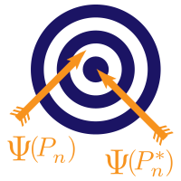

# Welcome! {-}

This open source, reproducible vignette is for a workshop on the
Targeted Learning framework for statistical and causal inference with machine
learning.  Beyond introducing Targeted Learning, the workshop focuses on
applying the methodology in practice using the [`tlverse` software
ecosystem](https://github.com/tlverse).  These materials are based on a working
draft of the book [*Targeted Learning in `R`: Causal Data Science with the
`tlverse` Software Ecosystem*](https://tlverse.org/tlverse-handbook/), which
includes in-depth discussion of these topics and much more, and may serve as a
useful reference to accompany these workshop materials.

 

## Important links {-}

* __Load R environment__: Please set up the `R` virtual environment using the
  [instructions](https://github.com/tlverse/tlverse-workshops/blob/master/install.md).
  If you experiencing issues with the `R` environment, you may install the 
  relevant software packages before the workshop using the [installation
  script](https://github.com/tlverse/tlverse-workshops/blob/master/install.R).

* You will probably exceed the GitHub API rate limit during this installation,
  which will throw an error. This issue and the solution are addressed
  [here](#installtlverse).

* __Code__: `R` script files for each section of the workshop are available via
  the GitHub repository for the workshop at
  https://github.com/tlverse/tlverse-workshops/tree/master/R_code

## About this workshop {-}

This workshop will provide a comprehensive introduction to the field of
_Targeted Learning (TL)_ for statistical and causal inference, and the 
corresponding [`tlverse` software ecosystem](https://github.com/tlverse). 
Emphasis will be placed on super learning (SL) and targeted minimum loss-based 
estimation (TMLE) for causal effects of single time point interventions. TMLE 
represents a finite-sample robust, efficient substitution estimation strategy 
that uses super (ensemble machine) learning to flexibly adjust for confounding 
while yielding valid statistical inference. We will discuss TMLE for the causal 
effects of static and dynamic interventions; time permitting, additional topics 
to be discussed will include estimation of the causal effects of optimal dynamic 
and stochastic interventions.

In addition to discussion, this workshop will incorporate both interactive
activities and hands-on, guided `R` programming exercises, to allow participants
the opportunity to familiarize themselves with methodology and tools that will
translate to real-world data analysis. It is highly recommended for participants
to have an understanding of basic statistical concepts such as confounding,
probability distributions, confidence intervals, hypothesis testing, and
regression. Advanced knowledge of mathematical statistics is useful but not
necessary. Familiarity with the `R` programming language will be essential.

## Outline {-}

* _Warm-up_: The Roadmap of Targeted Learning and [Why We Need A Statistical
  Revolution](https://senseaboutscienceusa.org/super-learning-and-the-revolution-in-knowledge/)
  with an *[introductory video lecture by Mark van der Laan and Alan
  Hubbard](https://www.dropbox.com/s/7b6ru2ahycqq80v/ENAR2021-lecture.mp4?dl=0)*
  (__Please watch this hour-long lecture before the workshop.__)
* 09:00-09:30A: [Introduction to the `tlverse` Software
  Ecosystem](https://tlverse.org) and the [WASH Benefits
  data](http://www.washbenefits.net/)
* 09:30-10:00A: Super learning with the [`sl3` `R`
  package](https://github.com/tlverse/sl3)
* 10:00-11:00A: Programming exercises with `sl3`
* 11:00-11:15A: Morning Coffee Break and Q&A
* 11:15-12:00P: Targeted Learning for causal inference with the [`tmle3` `R`
  package](https://github.com/tlverse/tmle3)
* 12:00-12:45P: Programming exercises with `tmle3`
* 12:45-01:30P: Lunch Break
* 01:30-02:15P: Optimal treatment regimes with the [`tmle3mopttx` `R`
  package](https://github.com/tlverse/tmle3mopttx)
* 02:15-03:00P: Programming exercises with `tmle3mopttx`
* 03:00-03:15P: Afternoon Coffee Break
* 03:15-04:00P: Stochastic treatment regimes with the [`tmle3shift` `R`
  package](https://github.com/tlverse/tmle3shift)
* 04:00-04:30P: Programming exercises with `tmle3shift`
* 04:30-05:00P: Concluding remarks and discussion

<!--
__NOTE: All listings are in Pacific Time.__
-->

## About the instructors {-}

### Mark van der Laan {-}

Mark van der Laan, PhD, is Professor of Biostatistics and Statistics at UC
Berkeley. His research interests include statistical methods in computational
biology, survival analysis, censored data, adaptive designs, targeted maximum
likelihood estimation, causal inference, data-adaptive loss-based learning, and
multiple testing. His research group developed loss-based super learning in
semiparametric models, based on cross-validation, as a generic optimal tool for
the estimation of infinite-dimensional parameters, such as nonparametric density
estimation and prediction with both censored and uncensored data. Building on
this work, his research group developed targeted maximum likelihood estimation
for a target parameter of the data-generating distribution in arbitrary
semiparametric and nonparametric models, as a generic optimal methodology for
statistical and causal inference. Most recently, Mark's group has focused in
part on the development of a centralized, principled set of software tools for
targeted learning, the `tlverse`.

### Alan Hubbard {-}

Alan Hubbard is Professor of Biostatistics, former head of the Division of
Biostatistics at UC Berkeley, and head of data analytics core at UC Berkeley's
SuperFund research program. His current research interests include causal
inference, variable importance analysis, statistical machine learning,
estimation of and inference for data-adaptive statistical target parameters, and
targeted minimum loss-based estimation. Research in his group is generally
motivated by applications to problems in computational biology, epidemiology,
and precision medicine.

### Jeremy Coyle {-}

Jeremy Coyle, PhD, is a consulting data scientist and statistical programmer,
currently leading the software development effort that has produced the
`tlverse` ecosystem of R packages and related software tools. Jeremy earned his
PhD in Biostatistics from UC Berkeley in 2016, primarily under the supervision
of Alan Hubbard.

### Nima Hejazi {-}

[Nima Hejazi](https://nimahejazi.org), PhD, is an incoming Assistant Professor
of Biostatistics at the [Harvard T.H. Chan School of Public
Health](https://www.hsph.harvard.edu/biostatistics/). He received his PhD in
biostatistics at UC Berkeley, working under the supervision of Mark van der Laan
and Alan Hubbard, and afterwards held an NSF postdoctoral research fellowship.
Nima's research interests blend causal inference, machine learning,
semiparametric estimation, and computational statistics -- areas of recent
emphasis include causal mediation analysis, efficiency under biased sampling
designs, non/semi-parametric sieve estimation with machine learning, and
targeted loss-based estimation. His work is primarily driven by applications in
clinical trials (esp. vaccine efficacy trials), infectious disease epidemiology,
and computational biology. Nima is passionate about statistical computing
and open source software design standards for statistical data science, and he
has co-led or contributed significantly to many `tlverse` packages (`hal9001`,
`sl3`, `tmle3`, `origami`, `tmle3shift`, `tmle3mediate`).

### Ivana Malenica {-}

Ivana Malenica is a PhD student in biostatistics advised by Mark van der Laan.
Ivana is currently a fellow at the Berkeley Institute for Data Science, after
serving as a NIH Biomedical Big Data and Freeport-McMoRan Genomic Engine fellow.
She earned her Master's in Biostatistics and Bachelor's in Mathematics, and
spent some time at the Translational Genomics Research Institute. Very broadly,
her research interests span non/semi-parametric theory, probability theory,
machine learning, causal inference and high-dimensional statistics. Most of her
current work involves complex dependent settings (dependence through time and
network) and adaptive sequential designs.

### Rachael Phillips {-}

Rachael Phillips is a PhD student in biostatistics, advised by Alan Hubbard and
Mark van der Laan. She has an MA in Biostatistics, BS in Biology, and BA in
Mathematics. Her research integrates causal inference, machine learning, and 
nonparametric statistics to realistically approximate answers to causal questions 
with statistical confidence. Motivated by issues arising in healthcare, the 
projects she's pursued include the development of (i) clinical algorithm frameworks 
and guidelines; (ii) real-world data analysis methodologies for generating and 
evaluating real-world evidence; (iii) open-source software, including key contributions to 
`sl3`, `origami` and `hal9001` packages; and (iv) biostatistics graduate-level 
courses and other educational material for targeted learning and causal inference.